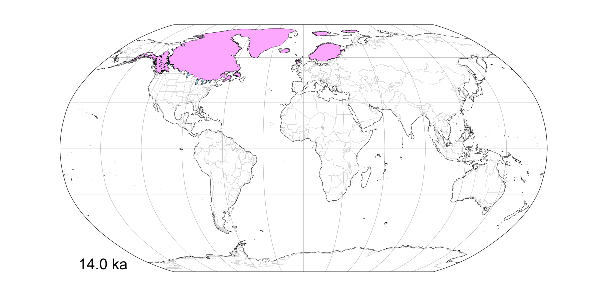

## Late-Quaternary paleogeography ##

This repository contains a set of shapefiles intended as a cartographic resource for mapping paleo data over the past 26,000 years.  This particular set of shapefiles include:

* shorelines, inferred from paleotopographic anomalies from the ICE-6G model applied to the present-day ETOPO1 global DEM
* ice sheets, from the GSC-OF1574 and DATED-1 shapefile collections
* proglacial lakes (in North America) from the GSC-OF1574 shapefile collection

The image above shows an example for 14 ka.

The folders include:

| Folder      | Description                                           |
|:----------- |:------------------------------------------------------|
|`/GlacialLakes`   | Proglacial lakes in North America from GSC-OF1574  | 
|`/IceSheets`      | Ice sheets from GSC-OF1574 for North America and from DATED-1 for Europe, as well as a set of merged files for the globe |
|`/R`              | R code for mapping the various shape files | 
|`/Shorelines`     | Inferred shorelines from ICE-6G topographic anomalies   | 

This is a preliminary version with inferred shorelines at 1 kyr intervals, paired with lake and ice sheet outlines selected from those available.

